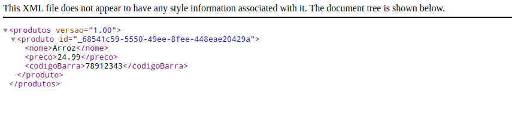

# SERVICE WEB XML - SpringBoot - 3.1.4

Nesse Serviço Web XML, há a funcionalidade de criar arquivos em XML. Aqui, você pode usá-la como base, pois permite a criação do documento, adição de elementos e, caso necessário, inclusão de atributos. Foram implementados dois métodos usando o verbo GET: um que lista um conjunto estático de informações e outro que permite o download do XML.

## Extensible Markup Language

XML (Extensible Markup Language) é uma linguagem de marcação que é amplamente utilizada para armazenar e transportar dados de forma estruturada e legível tanto para máquinas quanto para seres humanos. Ele consiste em um conjunto de regras que definem como os dados devem ser organizados em um formato hierárquico usando tags e elementos. Cada elemento XML possui um nome e pode conter atributos e valores de texto. Uma das principais características do XML é a sua capacidade de ser personalizado, permitindo que você crie suas próprias tags e estruturas de dados para atender às necessidades específicas de um aplicativo ou sistema. Isso o torna uma escolha popular para representar informações em uma variedade de domínios, desde documentos de texto até configurações de aplicativos e trocas de dados entre sistemas diferentes.


### Cria e Adiciona Documento
```
Document document = this.criarDocumento();

// elemento raiz do XML
Element raiz = document.createElement("produtos");
document.appendChild(raiz);

```

### Cria e adiciona atributo
```
this.criarAtrituto(raiz, document, "versao", "1.00");

```

